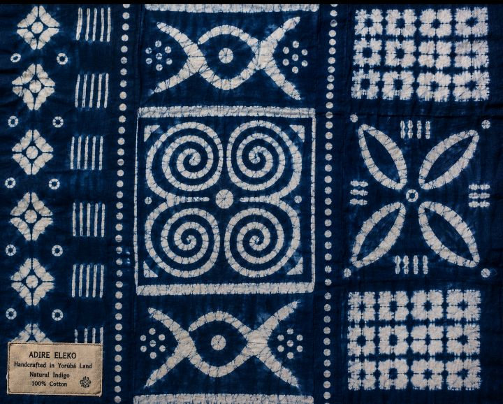

# 🧵 BIYORA SHOP — Premium African Textiles

> **Kwari Market Quality, Delivered.**  
> A modern, luxurious e-commerce experience showcasing the finest textiles from Kano’s iconic Kantin Kwari Market and premium African textile heritage.



**Live Demo:** [biyora-shop.vercel.app](https://biyora-shop.vercel.app)

---

## ✨ Features

### Core Experience
- **Stunning Home Page** — Hero with powerful cultural positioning, featured fabrics, category highlights, trust signals, and newsletter signup
- **Fully Functional Shop** — Real-time search, advanced filters (category, color family, pattern style, price range), sorting, beautiful responsive product grid
- **Premium Product Detail Pages** — High-quality image gallery, dynamic length selector with live price update, detailed specifications, “How to Style” suggestions, related products
- **Cart System** — Persistent cart with Zustand + localStorage, quantity & length management, live totals in ₦
- **Elegant Checkout** — Nigerian states dropdown, comprehensive address form, multiple realistic payment options, form validation with Zod + React Hook Form
- **Beautiful Order Success** — Confetti celebration, order number, “Track Order” demo

### Additional Pages
- **About** — Rich brand story connecting to Kwari Market heritage
- **Contact** — Fully working contact form
- **FAQ** — Helpful accordion with common customer questions

### Technical Excellence
- Next.js 15 (App Router) + TypeScript (strict) **→ Upgraded to 15.4.2 (security patch)**
- Tailwind CSS 4 + beautiful custom premium design system (burgundy, gold, cream, forest tones)
- Framer Motion for smooth animations
- Zustand with persist middleware for cart
- Sonner for elegant toast notifications
- React Hook Form + Zod for all forms
- Fully responsive + mobile-first with premium hamburger menu
- Loading states, empty states, and delightful micro-interactions
- Accessible and production-ready

---

## 🛠 Tech Stack

| Category          | Technology                          |
|-------------------|-------------------------------------|
| Framework         | Next.js 15 (App Router)            |
| Language          | TypeScript (strict mode)           |
| Styling           | Tailwind CSS 4                     |
| Animations        | Framer Motion                      |
| State Management  | Zustand + persist                  |
| Forms & Validation| React Hook Form + Zod              |
| Notifications     | Sonner                             |
| Icons             | Lucide React                       |
| Deployment        | Vercel (recommended)               |

---

## 🚀 Getting Started

### 1. Clone the repository

```bash
git clone https://github.com/idris81ahmad-cyber/biyora-shop.git
cd biyora-shop
```

### 2. Install dependencies

```bash
npm install
```

### 3. Run the development server

```bash
npm run dev
```

Open [http://localhost:3000](http://localhost:3000) in your browser.

### 4. Build for production

```bash
npm run build
npm start
```

---

## 📁 Project Structure

```
biyora-shop/
├── app/
│   ├── layout.tsx                 # Root layout + Navbar + Toaster
│   ├── page.tsx                   # Beautiful homepage
│   ├── globals.css                # Premium design system + Tailwind
│   ├── shop/
│   │   └── page.tsx               # Full shop with filters & search
│   ├── products/
│   │   └── [slug]/
│       └── page.tsx           # Dynamic product detail page
│   ├── cart/
│   │   └── page.tsx               # Dedicated cart experience
│   ├── checkout/
│   │   └── page.tsx               # Complete checkout flow
│   ├── success/
│   │   └── page.tsx               # Order confirmation + confetti
│   ├── about/
│   │   └── page.tsx
│   ├── contact/
│   │   └── page.tsx
│   └── faq/
│       └── page.tsx
├── components/
│   ├── Navbar.tsx
│   ├── Footer.tsx
│   └── ProductCard.tsx
├── lib/
│   ├── products.ts                # All 12 premium textile products
│   ├── cart-store.ts              # Zustand cart with persist
│   └── utils.ts
├── types/
│   └── product.ts
├── .github/
│   ├── workflows/
│   │   └── ci.yml                 # Lint + Typecheck + Build
│   └── PULL_REQUEST_TEMPLATE.md
├── package.json
├── next.config.ts
├── tsconfig.json
├── components.json                # shadcn/ui ready
├── README.md
└── .env.example
```

---

## 🧵 The 12 Premium Textile Products

| #  | Name                                      | Category                    | Price (₦)   | Length Options       |
|----|-------------------------------------------|-----------------------------|-------------|----------------------|
| 1  | Royal Gold Ankara Wax Print               | Ankara Prints               | 18,500     | 5yd, 6yd            |
| 2  | Swiss Voile Cord Lace – Ivory             | Premium Lace                | 48,000     | 5yd, 6yd            |
| 3  | Premium Guinea Brocade – Burgundy         | Brocade & Damask            | 35,000     | 5yd, 6yd, 10yd      |
| 4  | Indigo Adire Tie-Dye Fabric               | Adire & Tie-Dye             | 16,500     | 5yd, 6yd            |
| 5  | French Guipure Lace – Champagne Gold      | Premium Lace                | 55,000     | 5yd                 |
| 6  | Emerald Silk Chiffon – Luxe Drape         | Silk, Chiffon & Voile       | 29,500     | 5yd, 6yd            |
| 7  | Premium Solid Cotton Poplin – Warm Cream  | Plain & Solid Premium Cottons | 12,800   | 5yd, 6yd, 10yd      |
| 8  | Royal Blue Floral Ankara Wax Print        | Ankara Prints               | 19,200     | 5yd, 6yd            |
| 9  | Gold Thread Swiss Lace – White            | Premium Lace                | 42,500     | 5yd, 6yd            |
| 10 | Deep Green Damask Shadda                  | Brocade & Damask            | 38,000     | 5yd, 6yd, 10yd      |
| 11 | Sunset Orange Handcrafted Adire           | Adire & Tie-Dye             | 24,000     | 5yd, 6yd            |
| 12 | Soft Blush Pink Premium Voile             | Silk, Chiffon & Voile       | 15,200     | 5yd, 6yd, 10yd      |

All products include rich descriptions, realistic specs, multiple image URLs, ratings, and stock levels.

---

## 🛠 How to Add New Fabrics (Easy!)

1. Open `lib/products.ts`
2. Add a new object to the `products` array following the existing `Product` interface
3. Add image paths (`/images/your-fabric.jpg` in `public/images/`) or external URLs (configure hosts in `next.config.ts`)
4. That’s it — the shop, product pages, and filters will automatically include it!

---

## 📦 Deployment (Vercel — Recommended)

1. Push your code to GitHub
2. Go to [vercel.com](https://vercel.com) → New Project → Import `biyora-shop` repo
3. Vercel will auto-detect Next.js. Click **Deploy**
4. Your site will be live in under 2 minutes with automatic HTTPS + edge caching

**Custom Domain:** Add your domain in Vercel settings (recommended: `biyorashop.com` or similar)

---

## ✅ CI / Quality Checks

```bash
npm run lint
npm run typecheck
npm run build
```

A GitHub Actions workflow (`.github/workflows/ci.yml`) runs these checks on every push and PR.

---

## 🚩 Future Roadmap (Phase 2 Ideas)

- User accounts & order history
- Real payment integration (Paystack)
- Wholesale / bulk order flow
- Admin dashboard for inventory
- Digital swatch samples
- Reviews & ratings system (real)
- Multi-currency support

The current architecture is clean and scalable for these additions.

---

## 📸 Screenshots / Placeholders

*(Add your screenshots here after deployment)*

- Home hero
- Shop grid with filters
- Product detail page
- Cart & Checkout flow

---

## 🙏 Credits & Inspiration

- **Kantin Kwari Market, Kano** — The heartbeat of African textiles
- Design direction inspired by premium Nigerian fashion houses and global luxury e-commerce standards
- Built with love for African craftsmanship and modern digital experiences

---

## 📄 License

This project is open source for learning and personal/commercial use with attribution.  
Created for Idris Ahmad — BIYORA SHOP.

---

**Ready to launch your premium textile business?**  
This repository is production-grade, beautiful, and fully functional.

Made with precision by a senior full-stack developer & product designer.

**Last upgraded:** Next.js 15.4.2 (security patch) - June 30, 2026
